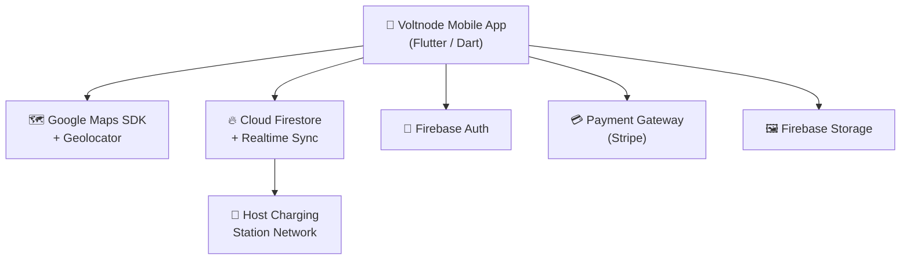

<div align="center">

# ⚡ Voltnode

### Peer-to-Peer EV Charging Network

**Find, book, and pay for EV charging at private home and commercial chargers, or turn your own charger into an income stream.**

[](https://flutter.dev)
[](https://dart.dev)
[](https://firebase.google.com)
[](#-getting-started)
[](LICENSE)
[](CONTRIBUTING.md)
[](https://github.com/SemilaAmajith2004/ev_charging_p2p/issues)
[](https://github.com/SemilaAmajith2004/ev_charging_p2p/stargazers)

[Overview](#-overview) • [Features](#-features) • [Getting Started](#-getting-started) • [Architecture](#-architecture) • [Roadmap](#-roadmap) • [Contributing](#-contributing)

</div>

---

## 📖 Table of Contents

- [Overview](#-overview)
- [Problem Statement](#-problem-statement)
- [Features](#-features)
- [Screenshots](#-screenshots)
- [Architecture](#-architecture)
- [Tech Stack](#-tech-stack)
- [Project Structure](#-project-structure)
- [Data Model](#-data-model)
- [Getting Started](#-getting-started)
- [Configuration](#-configuration)
- [Build & Release](#-build--release)
- [Testing & Code Quality](#-testing--code-quality)
- [Troubleshooting](#-troubleshooting)
- [Roadmap](#-roadmap)
- [Contributing](#-contributing)
- [Security](#-security)
- [License](#-license)
- [Author](#-author)
- [Acknowledgements](#-acknowledgements)

---

## 🌍 Overview

**Voltnode** is a cross-platform mobile application built with **Flutter** that connects **Electric Vehicle (EV) drivers** with **private charging station owners**.

- **Drivers** can discover nearby chargers, see real-time connector availability, reserve precise time slots, monitor a live charging session, and pay securely.
- **Hosts** can list residential or commercial chargers, manage availability schedules, set their own tariffs, and track earnings.
- **Anyone** can switch between **Driver Mode** and **Host Mode** in a single account.

---

## 🎯 Problem Statement

The rapid adoption of EVs has exposed serious public charging bottlenecks: long queues, broken connectors, and range anxiety, especially in rural and non-metropolitan areas.

Voltnode addresses this with a **decentralized peer-to-peer charging network**:

| For | Value |
|---|---|
| 🚗 **EV drivers** | Transparent access to a distributed network of private and community chargers. Pre-reserved time slots remove queue friction. |
| 🏠 **Charging hosts** | Monetize an idle charger during off-peak hours and build a secondary revenue stream. |
| 🌱 **The community** | Better use of existing infrastructure, with no need to build new stations for every gap in coverage. |

---

## ✨ Features

### 1. 🗺️ Map & Station Discovery
- Real-time geolocation rendered on Google Maps
- Filter by **power output (kW)**, **connector standard** (Type 2, CCS2, CHAdeMO), and **hourly tariff**
- Radius search and dynamic marker clustering for dense urban areas
- Search by name or address
- Dark-mode map styling

### 2. 📅 Station Profile & Time-Slot Reservation
- Detailed station pages with photos, ratings, and host verification badges
- Interactive time-slot matrix that **prevents overlapping bookings**
- Upfront dynamic price estimate based on duration and expected energy transfer
- Booking summary before confirmation

### 3. 💳 Payment & Live Charging Telemetry
- Card and digital wallet payments
- Live session dashboard: **energy delivered (kWh)**, **power rate (kW)**, **elapsed time**, and **running cost**
- Safety-first **manual session termination**
- Session receipt after completion

### 4. 🏠 Host Management Portal
- Onboarding flow to register chargers, set geo-location, upload photos, and define per-hour tariffs
- Schedule management: block slots for personal use
- Earnings analytics and session history

### 5. 👤 Profile & Dual-Role Switcher
- Instant switch between **Driver Mode** and **Host Mode**
- Vehicle profile management
- Saved payment methods and transaction history
- Booking history

### Platform capabilities
- 🔐 Firebase Authentication (sign up / login)
- ☁️ Cloud Firestore with real-time sync
- 🔔 Local and FCM push notifications
- 🎨 Material Design 3 with custom light and dark themes

---

## 📸 Screenshots

> Add screenshots or a demo GIF to `docs/images/` and update the table below. Projects with visuals get noticeably more engagement.

| Discovery Map | Station Details | Slot Booking |
|:---:|:---:|:---:|
|  |  |  |

| Live Charging | Host Dashboard | Profile / Role Switch |
|:---:|:---:|:---:|
|  |  |  |

---

## 🏗 Architecture



**Request flow (booking):**

```
Driver ─► discovers station ─► picks slot ─► booking locked in Firestore
       ─► pays via gateway   ─► session starts ─► live telemetry
       ─► session ends       ─► receipt + review
```

The app follows a layered structure: **screens → providers (state) → services (Firebase / GPS / payments) → models**.

---

## 🛠 Tech Stack

| Layer | Technology |
|---|---|
| **Framework** | Flutter 3.19+ / Dart 3.x |
| **UI** | Material Design 3 (custom light & dark themes) |
| **State management** | Provider (`lib/providers/`) |
| **Maps & location** | `google_maps_flutter`, `geolocator`, `geocoding` |
| **Backend** | Firebase Authentication, Cloud Firestore, Firebase Storage |
| **Payments** | Stripe / payment gateway integration (`payment_service.dart`) |
| **Notifications** | Local notifications + Firebase Cloud Messaging |
| **Local storage** | `shared_preferences` |
| **Build tooling** | JDK 17, Gradle (with Foojay toolchain resolver) |
| **CI/CD** | GitHub Actions (`.github/workflows/build.yml`) |

---

## 📁 Project Structure

```
ev_charging_p2p/
├── .github/workflows/
│   └── build.yml                   # CI build pipeline
├── android/                        # Native Android config (manifest, Gradle)
├── ios/                            # Native iOS config (Info.plist)
├── assets/
│   ├── icons/                      # Charger markers (Type 2, CCS2, CHAdeMO)
│   ├── images/                     # Branding and placeholder graphics
│   └── map_styles/                 # Dark-mode Google Maps JSON styles
│
├── lib/
│   ├── main.dart                   # Entry point & service initialization
│   │
│   ├── config/
│   │   ├── app_constants.dart      # Thresholds, tariffs, constants
│   │   ├── routes.dart             # Named routes
│   │   └── theme.dart              # Material 3 color schemes & typography
│   │
│   ├── models/
│   │   ├── station_model.dart      # Charging station profile
│   │   ├── booking_model.dart      # Time-slot reservation
│   │   ├── user_model.dart         # Driver & host profile
│   │   ├── session_model.dart      # Live charging telemetry
│   │   └── review_model.dart       # Ratings & feedback
│   │
│   ├── providers/
│   │   ├── auth_provider.dart      # Session & identity state
│   │   ├── map_provider.dart       # Location updates & pin filtering
│   │   ├── booking_provider.dart   # Slot locking & booking engine
│   │   └── host_provider.dart      # Listings & host dashboard state
│   │
│   ├── screens/
│   │   ├── auth/                   # login_screen, register_screen
│   │   ├── map/                    # discovery_map, filter_bottom_sheet, search_delegate
│   │   ├── booking/                # station_detail, slot_picker_dialog, booking_summary
│   │   ├── charging/               # checkout_payment, active_session, session_receipt
│   │   ├── host/                   # host_dashboard, add_charger, manage_slots, host_earnings
│   │   └── profile/                # profile, role_switcher, vehicle_management, booking_history
│   │
│   ├── services/
│   │   ├── firebase_service.dart   # Firestore CRUD wrappers
│   │   ├── location_service.dart   # GPS location streams
│   │   ├── payment_service.dart    # Payment gateway integration
│   │   └── notification_service.dart # Local & FCM push alerts
│   │
│   ├── utils/                      # date_time_formatter, distance_calculator, validator
│   └── widgets/                    # custom_button, charger_type_chip, station_card_item, loading_indicator
│
├── pubspec.yaml                    # Dependencies & asset manifest
├── firebase.json                   # Firebase CLI config
└── README.md
```

---

## 🗄 Data Model

Firestore collections used by the app (mirroring `lib/models/`):

| Collection | Purpose | Key concepts |
|---|---|---|
| `users` | Driver and host profiles | Role, vehicles, payment preferences |
| `stations` | Charger listings | Owner, location (lat/lng), connector type, power (kW), tariff, photos, availability |
| `bookings` | Time-slot reservations | Driver, station, start/end time, status, price |
| `sessions` | Live and completed charging sessions | kWh delivered, power rate, duration, cost |
| `reviews` | Ratings and feedback | Station, author, rating, comment |

> Update field-level details to match your actual Firestore schema.

---

## 🚀 Getting Started

### Prerequisites

| Tool | Version |
|---|---|
| [Flutter SDK](https://docs.flutter.dev/get-started/install) | 3.19.0 or higher |
| Dart SDK | 3.3.0 or higher (bundled with Flutter) |
| JDK | OpenJDK 17 |
| IDE | Android Studio or VS Code with the Flutter & Dart extensions |
| Google Maps API key | Maps SDK for Android / iOS enabled |
| Firebase project | Auth, Firestore, and Storage enabled |

Verify your setup:

```bash
flutter doctor
```

### Installation

**1. Clone the repository**

```bash
git clone https://github.com/SemilaAmajith2004/ev_charging_p2p.git
cd ev_charging_p2p
```

**2. Install dependencies**

```bash
flutter pub get
```

**3. Connect Firebase**

Create a project in the [Firebase Console](https://console.firebase.google.com/), then either:

- Use the FlutterFire CLI (recommended):
  ```bash
  dart pub global activate flutterfire_cli
  flutterfire configure
  ```
- Or manually download `google-services.json` into `android/app/` and `GoogleService-Info.plist` into `ios/Runner/`.

Enable these in the console:
- **Authentication** → Email/Password (and any other providers you use)
- **Cloud Firestore** → create a database
- **Storage** → for charger photos

**4. Add your Google Maps API key**

See [Configuration](#-configuration) below.

**5. Run the app**

```bash
flutter run
```

To target a specific device:

```bash
flutter devices
flutter run -d <device_id>
```

---

## ⚙️ Configuration

### Google Maps API key

**Android:** in `android/app/src/main/AndroidManifest.xml`

```xml
<meta-data
    android:name="com.google.android.geo.API_KEY"
    android:value="YOUR_GOOGLE_MAPS_API_KEY"/>
```

**iOS:** in `ios/Runner/AppDelegate.swift`

```swift
GMSServices.provideAPIKey("YOUR_GOOGLE_MAPS_API_KEY")
```

### ⚠️ Keep your keys out of Git

Never commit real API keys to a public repository. Recommended options:

- Store the key in `android/local.properties` (already git-ignored) and read it in Gradle via a manifest placeholder.
- Or pass it at build time with `--dart-define`.
- **Restrict your key** in Google Cloud Console (by Android package name + SHA-1, and iOS bundle ID) so a leaked key can't be abused.

Also add to `.gitignore`:

```
android/app/google-services.json
ios/Runner/GoogleService-Info.plist
lib/firebase_options.dart
.env
*.jks
key.properties
```

> If you publish these files, make sure they contain no real secrets. Firebase client config isn't secret by itself, but your **security rules** must be strict.

### Firestore security rules

Lock down your database before going public. Example starting point:

```js
rules_version = '2';
service cloud.firestore {
  match /databases/{database}/documents {
    match /users/{userId} {
      allow read, write: if request.auth != null && request.auth.uid == userId;
    }
    match /stations/{stationId} {
      allow read: if true;
      allow create: if request.auth != null;
      allow update, delete: if request.auth != null
        && request.auth.uid == resource.data.ownerId;
    }
    match /bookings/{bookingId} {
      allow read, write: if request.auth != null;
    }
  }
}
```

> Tighten these rules to match your final schema (for example, restrict `bookings` to the driver and station owner).

---

## 📦 Build & Release

### Android APK

```bash
flutter build apk --release
```

Output: `build/app/outputs/flutter-apk/app-release.apk`

### Android App Bundle (Play Store)

```bash
flutter build appbundle --release
```

### iOS (requires macOS + Xcode)

```bash
flutter build ios --release
```

---

## 🧪 Testing & Code Quality

```bash
# Format code
dart format .

# Static analysis
flutter analyze

# Run tests
flutter test

# Run tests with coverage
flutter test --coverage
```

The CI pipeline in `.github/workflows/build.yml` builds the project on every push. Please make sure `flutter analyze` and `flutter test` pass before opening a PR.

---

## 🩺 Troubleshooting

<details>
<summary><b>Windows: <code>git add .</code> fails with "failed to insert into database" (the <code>nul</code> file)</b></summary>

On Windows Git Bash, a reserved file named `nul` can break staging. Stage the real project folders instead:

```bash
git add lib/ pubspec.yaml pubspec.lock README.md android/ ios/ firebase.json
git commit -m "feat: system updates"
git push origin main
```

</details>

<details>
<summary><b>Map is blank / grey</b></summary>

- Check that your Google Maps API key is set correctly in the manifest / `AppDelegate`.
- Make sure **Maps SDK for Android / iOS** is enabled in Google Cloud Console and billing is active.
- Confirm location permissions are declared and granted.

</details>

<details>
<summary><b>Gradle / Java build errors</b></summary>

- Make sure `JAVA_HOME` points to **JDK 17**.
- Run `flutter clean && flutter pub get`, then rebuild.
- Check `flutter doctor -v` for toolchain issues.

</details>

<details>
<summary><b>Firebase initialization errors</b></summary>

- Confirm `google-services.json` / `GoogleService-Info.plist` are in the correct folders.
- Re-run `flutterfire configure` if `firebase_options.dart` is missing.

</details>

---

## 🗺 Roadmap

### Current
- [x] Authentication (register / login)
- [x] Map discovery with filters
- [x] Station profiles and slot booking
- [x] Payment checkout and live session screen
- [x] Host dashboard, charger listing, and earnings
- [x] Driver / Host role switcher

### Next release: Predictive, range-aware smart route planner

A machine-learning-driven navigation and battery-management engine:

- [ ] **OBD-II telematics & vehicle data integration**
  Real-time connection via Bluetooth OBD-II modules or OEM APIs (Tesla, Nissan Leaf, Hyundai) to read State of Charge (SoC %), battery health, and temperature.
- [ ] **Elevation & terrain energy modeling**
  Google Elevation API and Mapbox route profiling to estimate battery drain from inclines, speed profiles, and weather.
- [ ] **Automated dynamic slot reservation**
  Proactively suggest and reserve slots at optimal P2P stations before SoC drops below a safe threshold (for example, 15%).
- [ ] **Embedded turn-by-turn navigation**
  In-app routing to reserved hubs with live rerouting.

### Future ideas
- [ ] OCPP / smart-charger integration for remote start/stop
- [ ] Multi-language and multi-currency support
- [ ] Admin panel and moderation tools
- [ ] Host verification workflow
- [ ] Web dashboard for hosts

Have an idea? [Open a feature request](https://github.com/SemilaAmajith2004/ev_charging_p2p/issues/new).

---

## 🤝 Contributing

Contributions are what make open source great, and they are **greatly appreciated**.

1. **Fork** the repository
2. **Create** a feature branch
   ```bash
   git checkout -b feature/amazing-feature
   ```
3. **Make your changes**, then format and analyze
   ```bash
   dart format .
   flutter analyze
   flutter test
   ```
4. **Commit** with a clear message
   ```bash
   git commit -m "feat: add amazing feature"
   ```
5. **Push** and open a **Pull Request**
   ```bash
   git push origin feature/amazing-feature
   ```

### Guidelines
- Follow the existing folder structure (`screens` → `providers` → `services` → `models`).
- Use [Conventional Commits](https://www.conventionalcommits.org/) (`feat:`, `fix:`, `docs:`, `refactor:`, `test:`, `chore:`).
- Keep PRs small and focused; describe *what* and *why*.
- Add or update tests for new behaviour.
- Never commit API keys, keystores, or other secrets.

Look for issues labelled **`good first issue`** or **`help wanted`** if you're not sure where to start.

### Code of Conduct

This project follows the [Contributor Covenant](https://www.contributor-covenant.org/version/2/1/code_of_conduct/). Please be respectful and constructive.

---

## 🔒 Security

Voltnode handles **user accounts, location data, and payments**, so security matters.

If you find a vulnerability, **please do not open a public issue**. Contact the maintainer privately through GitHub ([@SemilaAmajith2004](https://github.com/SemilaAmajith2004)) with the details and steps to reproduce.

---

## 📄 License

Distributed under the **MIT License**. See [`LICENSE`](LICENSE) for details.

---

## 👨‍💻 Author

**Semila Amajith**
Department of Information and Communication Technology, Faculty of Technology
University of Sri Jayewardenepura

GitHub: [@SemilaAmajith2004](https://github.com/SemilaAmajith2004)
Project: [github.com/SemilaAmajith2004/ev_charging_p2p](https://github.com/SemilaAmajith2004/ev_charging_p2p)

---

## 🙏 Acknowledgements

- [Flutter](https://flutter.dev) and the Dart team
- [Firebase](https://firebase.google.com)
- [Google Maps Platform](https://mapsplatform.google.com)
- [Open Charge Alliance (OCPP)](https://openchargealliance.org) for charger interoperability standards
- [Shields.io](https://shields.io) for badges
- The open-source community ❤️

---

<div align="center">

**If Voltnode helps you, please consider giving it a ⭐**

</div>